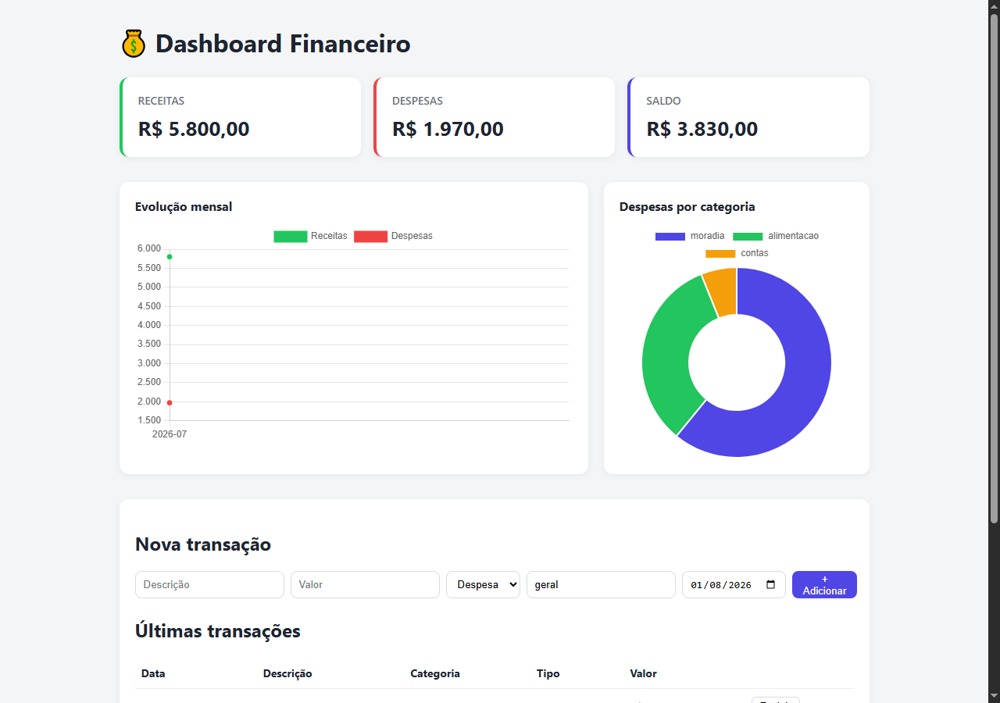

# 📌 Dashboard Financeiro + API

> API REST de controle financeiro (receitas e despesas) com dashboard em React exibindo cartões de resumo, evolução mensal e despesas por categoria.


[](LICENSE)

> 🌱 Projeto de aprendizado, feito enquanto eu estudava construção de APIs e visualização de dados com React/Chart.js.

## 🔗 Links

- 🚀 **Deploy:** [dashboard-financeiro-lyart-chi.vercel.app](https://dashboard-financeiro-lyart-chi.vercel.app)

> ⚠️ O backend está hospedado no plano gratuito do Render. Um workflow no GitHub Actions faz um ping a cada 10 min para manter a instância acordada, mas a primeira requisição ainda pode ocasionalmente levar alguns segundos a mais para responder.

## 🧠 Sobre o projeto

Controlar receitas e despesas pessoais (ou de um pequeno negócio) costuma ficar espalhado entre planilhas e anotações soltas. Este projeto centraliza isso em uma API própria e apresenta os dados de forma visual: quanto entrou, quanto saiu, qual o saldo, como as finanças evoluíram mês a mês e onde o dinheiro está sendo mais gasto.

## ✨ Funcionalidades

- Cadastro de transações (receita ou despesa) com descrição, valor, categoria e data
- Cartões de resumo: total de receitas, total de despesas e saldo
- Gráfico de linha com a evolução de receitas x despesas por mês
- Gráfico de rosca com despesas agrupadas por categoria
- Listagem e exclusão de transações
- Filtro de transações por mês na API (`?mes=AAAA-MM`)
- Seed automático de dados de exemplo quando o banco está vazio (ex: logo após um deploy)
- Testes de integração cobrindo validações e cálculos de resumo

## 🖥️ Prints



## 🛠️ Tecnologias

**Backend**
- Node.js + Express
- better-sqlite3
- Jest + Supertest (testes de integração)

**Frontend**
- React 18 + Vite
- Chart.js + react-chartjs-2 (gráficos de linha e rosca)
- Axios

## 📂 Estrutura do projeto

```
dashboard-financeiro/
├── backend/
│   ├── src/
│   │   ├── routes/       # transacoes.js, resumo.js
│   │   ├── data/seed.js  # dados de exemplo
│   │   ├── __tests__/
│   │   ├── db.js
│   │   ├── app.js
│   │   └── server.js
│   └── package.json
├── frontend/
│   ├── src/
│   │   ├── components/   # CartaoResumo, GraficoEvolucao, GraficoCategorias, FormTransacao
│   │   ├── api/
│   │   └── App.jsx
│   └── package.json
└── README.md
```

## ▶️ Como rodar localmente

### Backend

```bash
git clone https://github.com/Kashalicov/dashboard-financeiro.git
cd dashboard-financeiro/backend

cp .env.example .env
npm install
npm run dev
# o banco já vem populado automaticamente com dados de exemplo na primeira execução
# para resetar os dados de exemplo manualmente: npm run seed
# API disponível em http://localhost:3334
```

### Frontend

```bash
cd ../frontend
cp .env.example .env
npm install
npm run dev
# dashboard disponível em http://localhost:5173
```

## ✅ Testes

```bash
cd backend
npm test
```

Cobre: validação de campos obrigatórios, valores negativos/zerados, tipos e datas inválidas, filtro por mês, exclusão de transações e cálculo de totais/saldo/agrupamento por categoria.

## 📚 O que eu aprendi

Esse projeto foi minha primeira experiência estruturando queries SQL de agregação (`SUM`, `GROUP BY`) diretamente para alimentar gráficos no frontend, em vez de trazer todos os dados brutos e calcular no cliente — isso deixa a API mais reutilizável e o frontend mais simples. Também aprendi a organizar componentes de gráfico (Chart.js) de forma reutilizável e a validar dados financeiros com atenção redobrada (valores negativos, tipos inválidos, formato de data), já que erros nesse tipo de dado têm impacto real.

## 🚧 Possíveis melhorias futuras

- Autenticação (múltiplos usuários, cada um com suas próprias finanças)
- Edição de transações (hoje só é possível criar/excluir)
- Exportação de relatórios em PDF/CSV
- Metas de gastos por categoria com alertas

## 👤 Autor

**Júnior Rodrigues**
Coordenador de T.I. na Fundação Banco de Olhos | Estudante de Ciência da Computação

📫 [LinkedIn](https://www.linkedin.com/in/jrkdev/) · [GitHub](https://github.com/Kashalicov)
